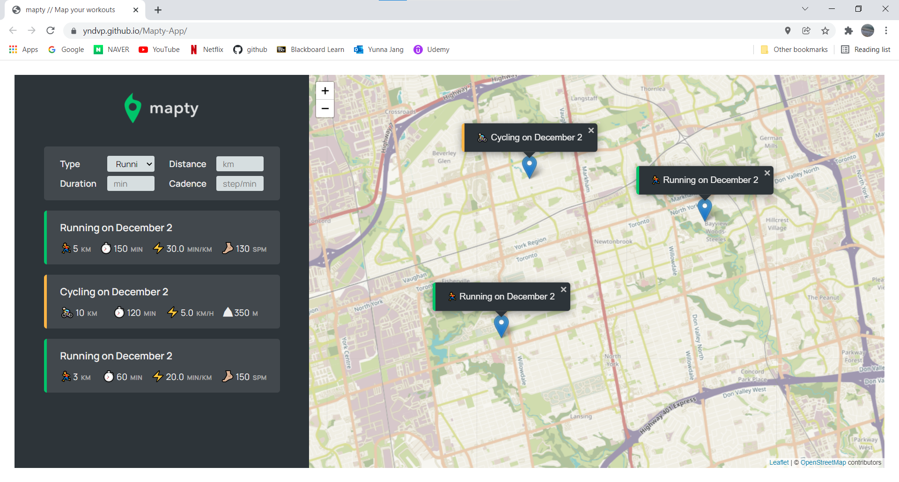
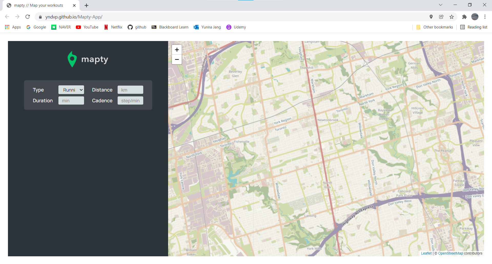
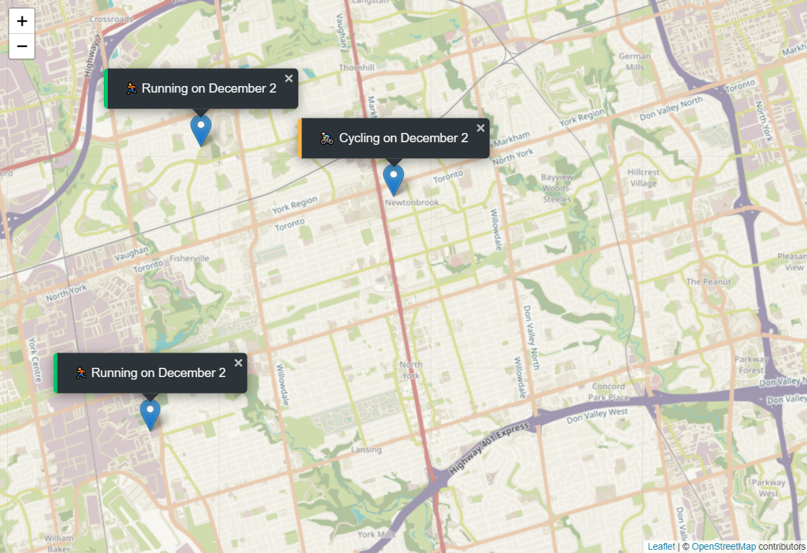
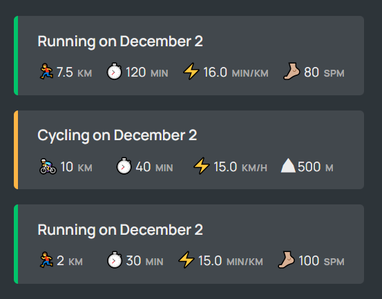
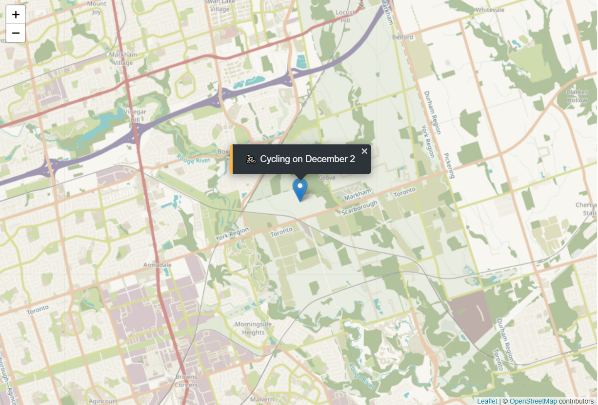

# Exercise Tracking App

## Overview
Exercise tracking application that user can pick location and log daily workout based on it.

## Technologies
- JavaScript
- Web Storage API(LocalStorage)
- Geolocation API
- Leaflet(map) Llibrary

## Features
- **Load the map based on user's geolocation information**

- **Allow users to pick location to save the log**

- **Once the user saves the log, it appears on the map with picked location**

- **Every log that user saves is organized and displayed**

- **If the user click one of the logs from log display, the location that matches with the log is automatically zoomed in**

